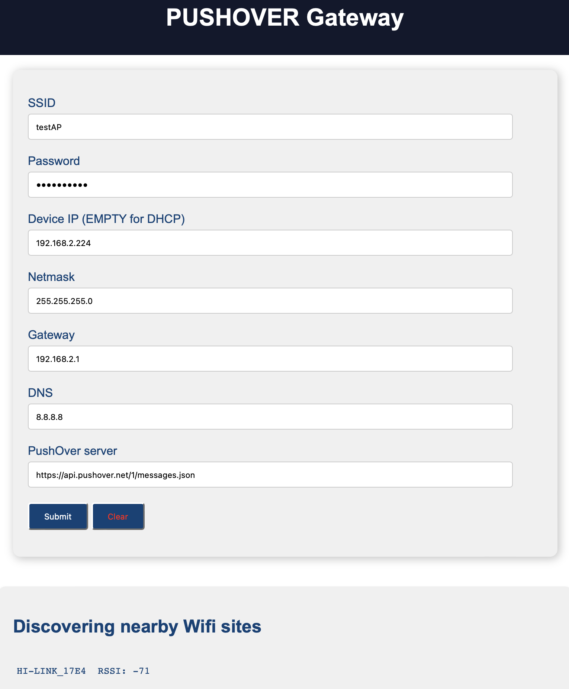

# PushOver Gateway for Foxtrot

When using the [Tecomat Foxtrot PLC](https://tecomat.com) to send push notifications to iOS or Android phones, you can use the services from [PushOver](https://pushover.net). The PLC Foxtrot 2 allows the prime use of TLS connection see. Foxtrot2 directory with the fbPushNotification function block. 

In the case of Foxtrot 1 the TLS security connection cannot be used. It is necessary to use an HTTP connection, see the foxtrot1 directory and the fbPushNotification1 function block. 

To avoid sending sensitive information, a simple gateway can be used. This converts push over greetings from http to https connections See the fbPushNotificationGtw function block in the foxtrot1 directory. 

## Function block

Function blocks are written in ST in IDE MOSAIC.

<table>
    <tr>
        <td></td>
        <td></td>
    </tr>
</table>

## Hardware

Gateway is based on ESP32. It allows you to set up a connection to a local wifi network with a fixed IP or DHCP. 

---
| ESP32 GPIO  | Note         |
|------------|---------------|
|   GPIO_NUM_2  | A BUTTON |
|   GPIO_NUM_0  | FLASH BUTTON |
|   GPIO_NUM_5  | HEART BEAT LED |

## HTTP command

Send message via gateway example:

`curl -X POST -H "Content-Type: application/x-www-form-urlencoded" -d "token=axxxxxxxxxx&user=uxxxxxxxxxxxx&title=TITLE_HERE&device=DEVICE&message=MESSAGE" http://192.168.2.224/push`

## Web interface

